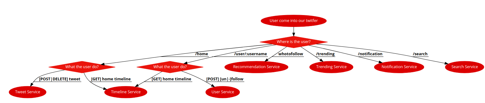
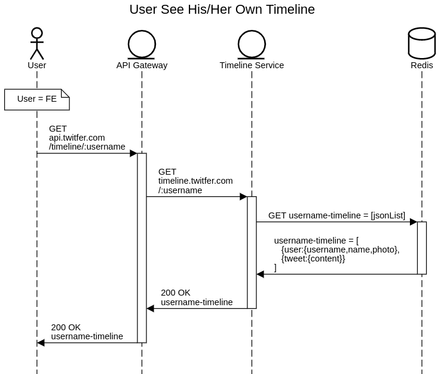
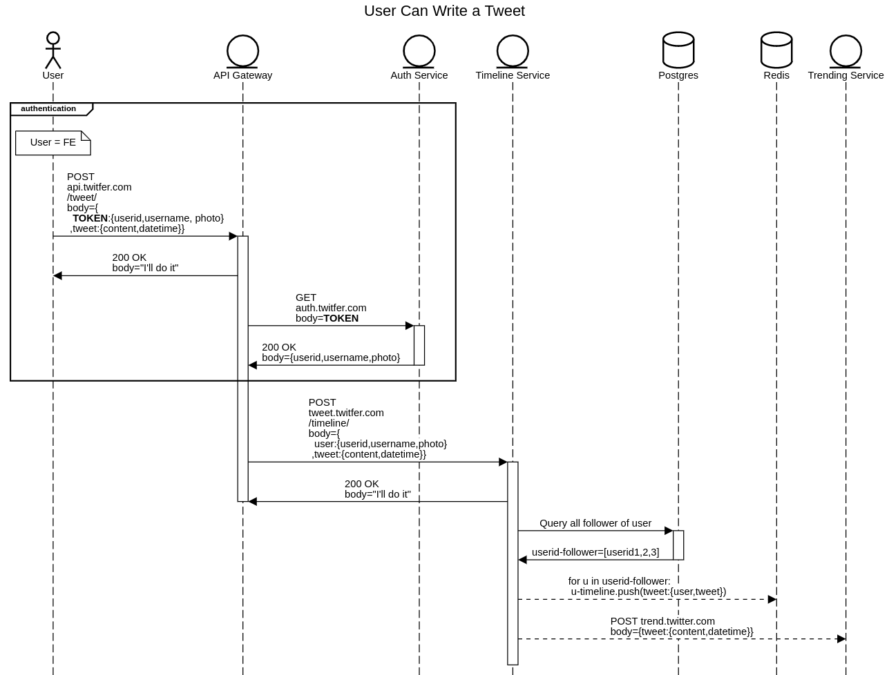

# Twitfer
Twitfer is my attempt of mimicking [Twitter](https://twitter.com) to learn system design. I used this project also as a (fun) way to learn many technology stack like Redis, 
Rabbitmq,  Kafka, Cassandra, Protobuf, etc.

I use microservices as architecture to help me achieve that goal because I just can plug and play different stack
in my services. For example, firstly, I'll build my timeline service as a push model using Redis(as I just know Redis :3 ).
Next, I wanna learn Cassandra, and replace Redis with Cassandra.

I'll try to keep this project heavily documented to keep track what I've done wrong and what I do correctly. 
You can see it in my [Designing Section](#designing).
 
## Table of Content
 - [Twitfer](#twitfer)
   * [Feature](#feature)
     + [Consideration](#consideration)
     + [Initial v1](#initial-v1)
     + [TODO](#todo)
   * [Screenshots](#screenshots)
   * [Tech/framework used](#tech-framework-used)
   * [Installation](#installation)
   * [Designing](#designing)
     + [Flowchart](#flowchart)
     + [Component Diagram](#component-diagram)
     + [Sequence Diagram](#sequence-diagram)
       - [User see his/her own timeline](#10-user-see-his-her-own-timeline)
       - [User can write a tweet](#12-user-can-write-a-tweet)
       - [User see someone else timeline(let user = user_x)](#2-user-see-someone-else-timeline-let-user---user-x-)
       - [User can search tweet by keyword](#3-user-can-search-tweet-by-keyword)
       - [User can see what tweet #hastag is being trending](#4-user-can-see-what-tweet--hastag-is-being-trending)
 
 <small><i><a href='http://ecotrust-canada.github.io/markdown-toc/'>Table of contents generated with markdown-toc</a></i></small>

## Feature

### Consideration
* READ Heavy
* Can sacrifice WRITE performance

### Initial v1
- [ ] User can see his/her own timeline
    - [ ] User can see tweet from his following(let tweet = tweet_x)
        - [ ] User can see tweet_x detail(add replies)
        - [ ] User can reply tweet_x
    - [ ] User can write/delete a tweet
    - [ ] User is recommended "whotofollow": similar user based of his/her following
- [ ] User can see someone else timeline(let user = user_x)
    - [ ] User can see tweet from user_x(let tweet = tweet_y)
        - [ ] User can see tweet_x detail(add replies)
        - [ ] User can reply tweet_x
    - [ ] User can follow/unfollow user_x
    - [ ] User can see profile of user_x
        - [ ] follower_count/following_count
        - [ ] photo, username, name
    - [ ] User is recommended "youmightlike": similar user with user_x
- [ ] User is notified when:
    - [ ] his/her tweet is replied
    - [ ] 
- [ ] User can search tweet by keyword
- [ ] User can see what tweet #hastag is being trending
 
### TODO
- [ ] Retweet
- [ ] Chat
 
## Screenshots
- [ ] TODO: Include logo/demo screenshot etc.

## Tech/framework used
* Docker
* React
* Go
* Redis
* Postgres
* Apache Kafka
* Python

## Installation
Provide step by step series of examples and explanations about how to get a development env running.

## Designing

### Flowchart
```
User come into our twitfer;
switch (Where is the user?) {
  /home => switch(What the user do?) {
    [GET] home timeline => Timeline Service;
    [POST|DELETE] tweet => Tweet Service;
  };
  /user/:username => switch (What the user do?) {
    [POST] [un|-]follow => User Service;
    [GET] home timeline => Timeline Service;
  };
  whotofollow => Recommendation Service;
  /trending => Trending Service;
  /notification => Notification Service;
  /search => Search Service;
}
```
This flowchart can be generated to the below image with [code2flow](https://app.code2flow.com/)


### Component Diagram
TODO 

### Sequence Diagram

#### 1.0 User see his/her own timeline
```
title User See His/Her Own Timeline

actor User
entity API Gateway
entity Timeline Service
database Redis

note over User: User = FE
User->API Gateway: GET \napi.twitfer.com \n/timeline/:userid
activate API Gateway
API Gateway->Timeline Service: GET \ntimeline.twitfer.com \n/:userid
activate Timeline Service
Timeline Service->Redis: GET userid-timeline = [jsonList]
activate Redis
Redis->Timeline Service: username-timeline = [\n   {user:{username},\n   {tweet:{content}}\n]
deactivate Redis
Timeline Service->API Gateway: 200 OK \nuserid-timeline
deactivate Timeline Service
API Gateway->User: 200 OK \nuserid-timeline
deactivate API Gateway
```    
This sequence can be generated to the below image with [SequenceDiagram.org](https://sequencediagram.org/)

#### 1.2 User can write a tweet
```
title User Can Write a Tweet


actor User
entity API Gateway
entity Auth Service
entity Timeline Service
database Postgres
database Redis
entity Trending Service

group authentication
note over User: User = FE
User->API Gateway: POST \napi.twitfer.com \n/tweet/\nbody={\n  **TOKEN**:{userid,username, photo}\n ,tweet:{content,datetime}}
activate API Gateway
API Gateway->User: 200 OK\nbody="I'll do it"
API Gateway->Auth Service: GET \nauth.twitfer.com\nbody=**TOKEN**
activate Auth Service
Auth Service->API Gateway: 200 OK\nbody={userid,username,photo}
deactivate Auth Service
end 

API Gateway->Timeline Service: POST \ntweet.twitfer.com \n/timeline/\nbody={\n  user:{userid,username,photo}\n ,tweet:{content,datetime}}
activate Timeline Service
Timeline Service->API Gateway: 200 OK\nbody="I'll do it"
deactivate API Gateway

Timeline Service->Postgres: Query all follower of user
activate Postgres
Postgres->Timeline Service: userid-follower=[userid1,2,3]
deactivate Postgres

Timeline Service-->Redis: for u in userid-follower:\n u-timeline.push(tweet:{user,tweet})

Timeline Service-->Trending Service: POST trend.twitter.com\nbody={tweet:{content,datetime}}

```

#### 2 User see someone else timeline(let user = user_x)
#### 3 User can search tweet by keyword
#### 4 User can see what tweet #hastag is being trending